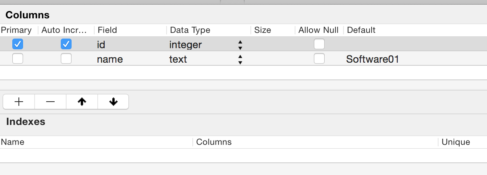
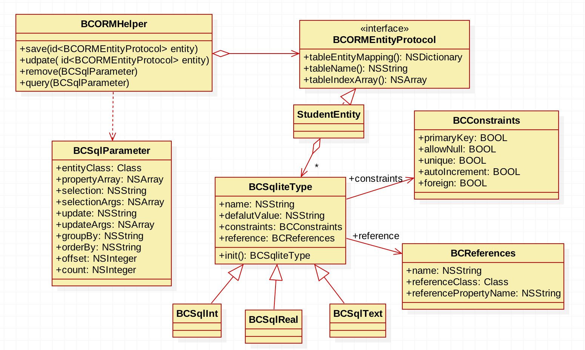

# BCSqliteORM v1.0
an objective-c ORM   base on FMDB(https://github.com/ccgus/fmdb) and objective-c runtime.


Usage
====

Setup
----
I am using [FMDB](https://github.com/ccgus/fmdb) as SQLite wrapper.

Implement BCORMEntityProtocol
------------------------------

make your model entity implement BCORMEntityProtocol protocol


``` objectivec
@interface ClassEntity : NSObject<BCORMEntityProtocol>
@property (nonatomic,assign)NSInteger classId;
@property (nonatomic,copy)NSString* className;
@end
```


``` objectivec
@implementation ClassEntity
- (NSString *)description
{
    return [NSString stringWithFormat:@"[Class:id(%ld) name:(%@)]:%p",self.classId,self.className,self];
}

+(NSString*)tableName
{
    return @"class";
}

+(NSDictionary*)tableEntityMapping
{
    return @{ @"classId":BCSqliteTypeMakeIntPrimaryKey(@"id", YES),
              @"className":BCSqliteTypeMakeTextDefault(@"name", NO,@"Software01")
              };
}
@end
```
it will build a table like this.or just make a mapping 


it will build a sql like this:
``` objectivec
CREATE TABLE class (
  id integer PRIMARY KEY AUTOINCREMENT NOT NULL,
  name text NOT NULL DEFAULT('Software01')
);
```


Open OR create a database file
------------------------------
you can create a new datase file ,or open an existing file like this

``` objectivec
BCORMHelper* helper = [[BCORMHelper alloc]initWithDatabaseName:@"test.db" 
				           enties: @[ [ClassEntity class],[StudentEntity class]]];
```
OR

``` objectivec
BCORMHelper* helper = [[BCORMHelper alloc]													initWithDatabasePath:@"/Users/BlockCheng/Library/Application Support/test.db" 
			enties: @[ [ClassEntity class],[StudentEntity class]]];
```


Save an Model
-------------

an example model:
``` objectivec
ClassEntity* classeEntity = [ClassEntity new];
classeEntity.className = @"Software02";
classeEntity.classId = 2;

StudentEntity* student = [StudentEntity new];
student.age = 12;
student.score = 80;
student.classId = 2;
student.studentNum = 421125;
student.studentName = @"BlockCheng";
```


``` objectivec
[helper save:classeEntity];

[helper save:student];
```


	
query a model
-------------
``` objectivec
BCSqlParameter *queryParam  = [[BCSqlParameter  alloc] init];
queryParam.entityClass = [StudentEntity class];
queryParam.propertyArray = @[@"age",@"classId",@"score",@"studentName",@"studentNum"];
queryParam.selection = @"classId = ? and studentNum=?";
queryParam.selectionArgs = @[@1,@421128];
queryParam.orderBy = @" studentNum  asc";
id entity  = [helper queryEntityByCondition:queryParam];
NSLog(@"entity:----%@",entity);
```
OR simply use
``` objectivec
entity  = [helper queryEntityByCondition:BCQueryParameterMake([StudentEntity class],
						@[@"age",@"classId",@"score",@"studentName",@"studentNum"],@"classId = ? and studentNum=?",
						@[@1,@421128], 
						@" studentNum  asc", nil, -1, -1)];
NSLog(@"entity:----%@",entity);
```


query many models
-----------------
``` objectivec
NSArray* entities  = [helper queryEntitiesByCondition:
				BCQueryParameterMake([ClassEntity class],
				nil, @"classId = ?", @[@1],
				nil, nil, -1, -1)];
NSLog(@"entities:----%@",entities);
```
OR 
``` objectivec
BCSqlParameter *queryParam  = [[BCSqlParameter  alloc] init];
queryParam.entityClass = [StudentEntity class];
queryParam.selection = @"classId = ?";
queryParam.selectionArgs = @[@1];
NSArray* entities  = [helper queryEntitiesByCondition:queryParam];
```

update 
-------
``` objectivec
[helper update:student];
    
```
OR with a update condition
``` objectivec
[helper updateByCondition:BCUpdateParameterMake([StudentEntity class],@"studentName=?", @[@"new_name"],@"studentNum=?", @[@421125])];
```

delete 
-------
``` objectivec
[helper remove:entity];
    
```
OR with delete condition
``` objectivec
[helper deleteByCondition:BCDeleteParameterMake([StudentEntity class],@"studentNum < ?", @[@421135])];
    
```

architecture

## License

The license for BCSqliteORM is contained in the "License.txt" file.
